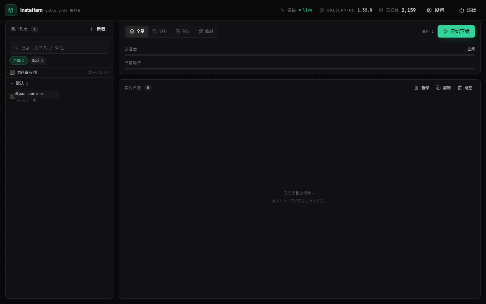
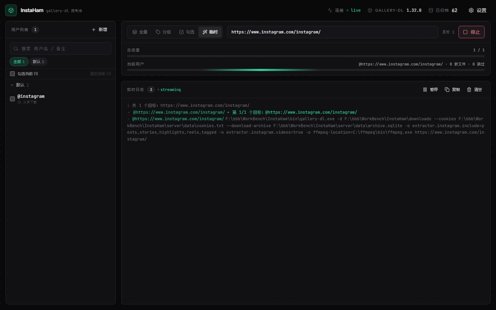

<div align="center">

# InstaHam

**A local Instagram downloader with a real‑time web console.**
Built on top of [`gallery-dl`](https://codeberg.org/mikf/gallery-dl), wrapped in a FastAPI backend and a React + Tailwind UI.

[](LICENSE)
[](https://python.org)
[](https://nodejs.org)
[](https://fastapi.tiangolo.com)
[](https://react.dev)
[](https://vitejs.dev)
[](https://tailwindcss.com)
[](https://codeberg.org/mikf/gallery-dl)
[](#)

[English](README.md) · [简体中文](README.zh-CN.md)

</div>

---

## ✨ Why InstaHam?

`gallery-dl` is the gold standard CLI for Instagram archiving — but a CLI is not what you want when you're running it every day. **InstaHam wraps it in a console that feels like a developer tool**: dark, dense, monospace where it counts, with a streaming log that updates as files land on disk. It is **fully local** — no telemetry, no remote calls beyond the Instagram requests `gallery-dl` already makes.

> ⚠️ **For personal/archival use only.** Respect Instagram's Terms of Service and the privacy of the users whose content you download.

## 📸 Screenshots

<div align="center">



<sub><em>Home — three‑pane operator console (zinc + emerald, Inter + JetBrains Mono).</em></sub>



<sub><em>Active download — dual progress bars, streaming log, indeterminate sweep across 0–100%.</em></sub>

</div>

## 🌟 Features

- **Real‑time WebSocket log** — every line `gallery-dl` emits arrives in the UI as it happens (no polling, no buffer lag).
- **Dual progress bars** — overall (`N / M` users) + current target (file count + skip count).
- **Four download modes** — All, By group, Selected (checkbox bulk), Ad‑hoc (paste any IG URL — no commit to user list).
- **Group management** — collapsible left pane, tag filtering, search, inline edit/add/delete, last‑download timestamp per user.
- **Cookie drawer** — paste Netscape‑format cookies, test against a public account before committing.
- **Smart deduplication** — shared `archive.sqlite` across all targets; reruns produce skip lines, not duplicates.
- **One‑click shutdown** — `⏻ 退出` button kills the backend process from the browser.
- **One‑file launcher** — `launcher.bat` checks the port, starts `uvicorn` hidden, polls until ready, then opens your default browser.

## 🛠 Tech Stack

| Layer | Stack |
|---|---|
| **Core** | `gallery-dl 1.32.0` (Codeberg) + `ffmpeg` (DASH merge) |
| **Backend** | Python 3.11+ · FastAPI · uvicorn · `subprocess.Popen` streaming |
| **Frontend** | React 19 · Vite 8 · TypeScript · Tailwind CSS 3 · Zustand · lucide‑react |
| **Fonts** | Inter (UI) · JetBrains Mono (data/log/paths) — bundled via `@fontsource` |
| **Launcher** | PowerShell (port polling, hidden window, auto‑browser) |

## 🚀 Quick Start (Windows)

### Prerequisites

| Tool | Version | Notes |
|---|---|---|
| **Python** | 3.11+ | Use the `py` launcher (Windows default). |
| **Node.js** | 18+ | For the frontend build. |
| **ffmpeg** | any recent | Only required if `videos_mode = true` (DASH merge). [Get builds](https://www.gyan.dev/ffmpeg/builds/). |

### 1 · Clone & set up

```powershell
git clone https://github.com/FruityMaxine/InstaHam.git
cd InstaHam

# One-shot setup: installs Python deps + builds frontend.
# gallery-dl.exe is already bundled in bin/ (no extra download).
powershell -NoProfile -ExecutionPolicy Bypass -File scripts/setup.ps1

# Optional: upgrade gallery-dl.exe to the latest Codeberg release
# powershell -NoProfile -ExecutionPolicy Bypass -File scripts/setup.ps1 -Force
```

### 2 · Run

```powershell
.\launcher.bat
```

The launcher detects whether the server is already running, starts it hidden if not, polls until the port is up, then opens `http://127.0.0.1:8765` in your default browser.

### 3 · Drop in your cookies

1. Install the Chrome extension **Get cookies.txt LOCALLY**
2. Log in to instagram.com
3. Click the extension → **Current site** → **Netscape format** → download
4. In InstaHam, click **设置 (Settings)** → paste the file content into the **Cookies** textarea → **测试 cookies** to verify → **保存**

### 4 · Add users & download

- **Left pane → 新增** to add an Instagram username (no `@`)
- **Top → 开始下载** with mode = 全量 / 分组 / 勾选 / 临时

## ⚙️ Configuration

`server/data/config.json` (auto‑created from `config.example.json` on first run):

| Field | Description | Default |
|---|---|---|
| `download_dir` | Root folder for downloaded media | `downloads` |
| `concurrency` | gallery‑dl concurrency hint | `2` |
| `videos_mode` | `true` (DASH, needs ffmpeg) · `merged` (pre‑merged) · `false` (skip) | `true` |
| `ffmpeg_location` | Absolute path to `ffmpeg.exe` | `C:\ffmpeg\bin\ffmpeg.exe` |
| `include` | Subset of `posts / stories / highlights / reels / tagged / avatar` | all five |

You can edit these directly in the file or via the in‑app settings drawer.

## 🗂 Architecture

```
┌────────────┐   WebSocket /ws/download         ┌─────────────────────┐
│  Browser   │ ◄──────────────────────────────► │   FastAPI (8765)    │
│ (React UI) │   REST  /api/{users,config,…}    │  uvicorn + asyncio  │
└────────────┘                                  └─────────┬───────────┘
                                                          │ subprocess.Popen
                                                          ▼   (line‑by‑line)
                                              ┌────────────────────────┐
                                              │  gallery-dl.exe        │
                                              │  --cookies cookies.txt │
                                              │  --download-archive    │
                                              └─────────┬──────────────┘
                                                        ▼
                                          downloads/instagram/<user>/…
```

**Key design decisions:**

- `subprocess.Popen` + line‑level `yield` (never `.run()` / `communicate()`) so the WebSocket can stream output as gallery‑dl prints it.
- `stdout` and `stderr` each pumped by their own daemon thread into a single `Queue` — no buffer deadlock.
- All gallery‑dl invocations carry `--cookies server/data/cookies.txt` and `--download-archive server/data/archive.sqlite` for centralized auth + dedup.
- Settings persisted as plain JSON; `archive.sqlite` is the only binary state.
- React state in **Zustand** (one global store, no prop drilling).

## 📁 Project Layout

```
InstaHam/
├── launcher.bat              # 1‑line wrapper -> launcher.ps1
├── launcher.ps1              # port poll, hidden uvicorn, auto‑browser
├── scripts/
│   └── setup.ps1             # download gallery-dl + install deps + build
├── bin/gallery-dl.exe        # bundled (GPL-2.0; see bin/README.md)
├── downloads/                # output (gitignored)
├── docs/screenshots/         # README assets
├── server/                   # Python backend
│   ├── main.py               # FastAPI entrypoint
│   ├── api/                  # REST + WebSocket routes
│   │   ├── users.py          # /api/users CRUD + groups
│   │   ├── config.py         # /api/config + cookie test
│   │   ├── archive.py        # /api/archive/stats
│   │   ├── system.py         # /api/system/shutdown
│   │   ├── ws.py             # /ws/download
│   │   └── storage.py        # JSON IO
│   ├── core/
│   │   ├── gallery_dl.py     # Popen wrapper, Event stream
│   │   ├── output_parser.py  # parse log lines (file / skip / error / warning)
│   │   └── archive.py        # sqlite stats
│   └── data/                 # cookies / users / config / archive (gitignored)
└── web/                      # React + Vite + Tailwind
    ├── src/
    │   ├── App.tsx
    │   ├── components/       # TopBar / Sidebar / TaskPanel / LogStream / …
    │   └── lib/              # api client, zustand store
    └── dist/                 # build output (gitignored, served by FastAPI)
```

## 🌐 API Reference

### REST

| Method | Path | Description |
|---|---|---|
| `GET` | `/api/users` | List users + groups |
| `POST` | `/api/users` | Add user `{username, group, note?}` |
| `PATCH` | `/api/users/{id}` | Update user |
| `DELETE` | `/api/users/{id}` | Remove user |
| `GET / POST / DELETE` | `/api/users/groups[/{name}]` | Manage groups |
| `GET / PUT` | `/api/config` | Read / patch config |
| `PUT` | `/api/config/cookies` | Replace cookies file |
| `POST` | `/api/config/test-cookies?target=...` | Run a `gallery-dl --simulate` smoke test |
| `GET` | `/api/config/version` | gallery‑dl version |
| `GET` | `/api/archive/stats` | Archive size + per‑extractor counts |
| `POST` | `/api/system/shutdown` | Terminate the backend process |

### WebSocket

`GET /ws/download` — request payload:

```json
{ "mode": "all" | "group" | "selected" | "adhoc",
  "users": ["id1","id2"],   // selected mode
  "group": "group name",    // group mode
  "urls":  ["https://..."]  // adhoc mode
}
```

Server pushes JSON events:

```ts
{ type: "meta",       total, targets[] }
{ type: "user_start", index, total, user }
{ type: "started",    text, user }   // full gallery-dl command
{ type: "log" | "file" | "skip" | "warning" | "error", text, file_path?, user }
{ type: "done",       code, user }
{ type: "all_done" }
```

## 💻 Development

```bash
# Backend (auto‑reload)
py -m uvicorn server.main:app --reload --port 8765

# Frontend (dev server with hot‑reload + proxy to 8765)
cd web
npm run dev          # http://localhost:5173

# Production build
npm run build        # outputs to web/dist/, served by FastAPI on /
```

## ❓ FAQ

**The browser opens a 404 page.**
`web/dist/` hasn't been built yet. Run `cd web && npm run build` (or `scripts/setup.ps1`).

**Top bar shows `连接 offline`.**
The backend died. Check `server.log` in the project root.

**Download stuck on "started" forever.**
Cookies likely expired. Open Settings → **测试 cookies**. If it fails, re‑export and paste fresh ones.

**Videos play silently or look low‑quality.**
`videos_mode = true` requires `ffmpeg` to merge DASH streams. Either install ffmpeg and set the path, or switch to `merged` mode.

**`launcher.bat` printed `'dp0' is not a command`.**
You edited the file with an editor that converted line endings to LF. `.bat` files **must** use CRLF. Re‑clone or fix line endings.

**Why Codeberg for `gallery-dl`?**
Upstream moved active development from GitHub to Codeberg in 2024+. The GitHub releases page no longer ships `.exe` assets.

## 🤝 Contributing

PRs and issues welcome. See [CONTRIBUTING.md](CONTRIBUTING.md) for development workflow.

If you're hacking on the UI, please match the existing aesthetic conventions:
- single accent (emerald‑400) — don't add a second hue
- monospace (`font-mono`) for any data: usernames, paths, log lines, large numbers
- `panel`, `btn-primary`, `btn-ghost`, `btn-outline`, `input`, `chip`, `label` utility classes — see `web/src/index.css`

## 📜 License

[MIT](LICENSE) © 2026 FruityMaxine

This project ships a wrapper around — but does **not** statically link or embed — [`gallery-dl`](https://codeberg.org/mikf/gallery-dl) (GPL‑2.0). gallery‑dl is invoked as an external binary downloaded by `scripts/setup.ps1`.

## 🙏 Acknowledgments

- [`gallery-dl`](https://codeberg.org/mikf/gallery-dl) — Mike Fährmann's tireless extractor work.
- [shadcn/ui](https://ui.shadcn.com) — design vocabulary that shaped the component layer (handcrafted equivalents here, no runtime dep).
- [Lucide](https://lucide.dev), [Inter](https://rsms.me/inter), [JetBrains Mono](https://www.jetbrains.com/lp/mono).
