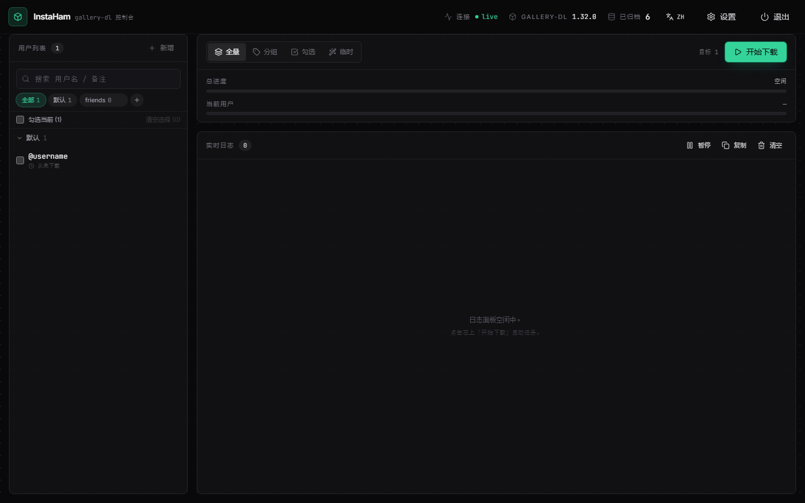
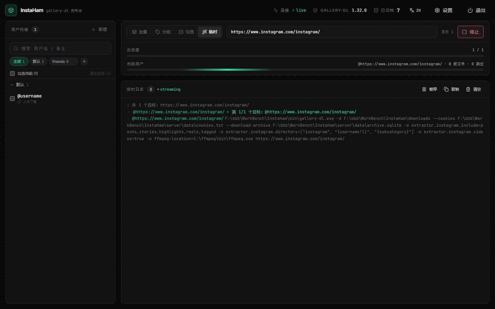
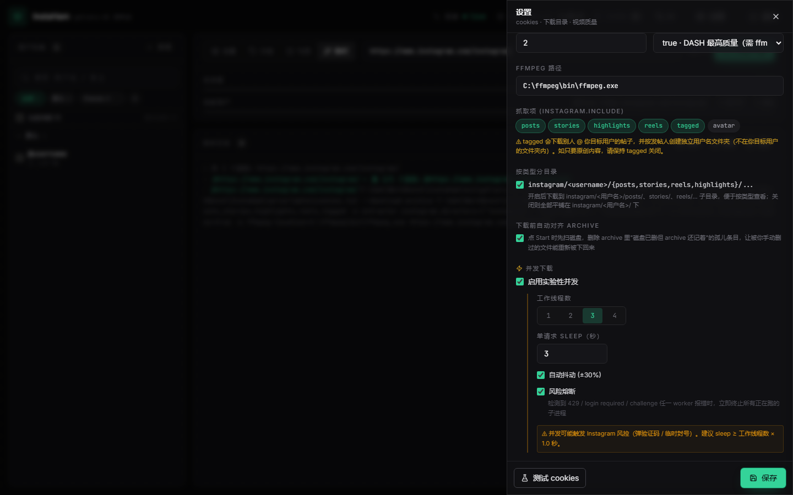
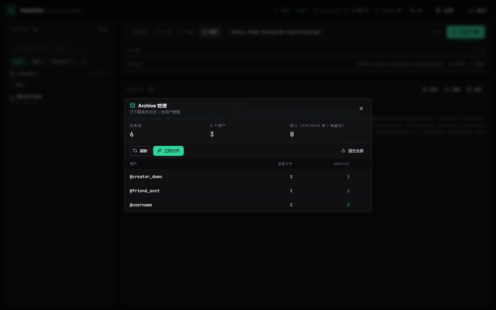

<div align="center">

# InstaHam

**本地 Instagram 下载器，配带实时 Web 控制台。**
基于 [`gallery-dl`](https://codeberg.org/mikf/gallery-dl)，由 FastAPI 后端 + React + Tailwind 前端封装。

[](LICENSE)
[](https://python.org)
[](https://nodejs.org)
[](https://fastapi.tiangolo.com)
[](https://react.dev)
[](https://vitejs.dev)
[](https://tailwindcss.com)
[](https://codeberg.org/mikf/gallery-dl)
[](#)

[English](README.md) · [简体中文](README.zh-CN.md)

</div>

---

## ✨ 为什么做 InstaHam？

`gallery-dl` 是 Instagram 抓取的事实标准 CLI，但每天用 CLI 是种折磨。**InstaHam 把它包装成一个开发者工具气质的控制台**：暗色、信息密度高、关键数据用等宽字体，日志随抓随出。**全本地**，除了 `gallery-dl` 本身的 Instagram 请求之外没有任何遥测或外发请求。

> ⚠️ **仅供个人归档使用。** 请遵守 Instagram 服务条款，尊重你下载内容的所有者隐私。

## 📸 截图

<div align="center">



<sub><em>主界面 —— 三栏操作员控制台（zinc 暗色 + emerald 单点强调，Inter + JetBrains Mono）。</em></sub>



<sub><em>下载进行中 —— 双层进度条，流式日志，不定进度条横扫 0–100%。</em></sub>



<sub><em>设置 —— 粘贴 cookies，调下载目录 / 视频模式 / 抓取项，可选实验性并发下载，自带风险熔断。</em></sub>



<sub><em>档案管理 —— 按用户查看 archive 条目，一键对齐磁盘（让你手动删过的文件能重下回来），可单删某用户或全清。</em></sub>

</div>

## 🌟 特性

- **实时 WebSocket 日志** —— `gallery-dl` 每输出一行立即推到 UI（不轮询、不缓冲）。
- **双层进度条** —— 总进度（`N / M` 个用户）+ 当前用户进度（新文件数 + 跳过数）。
- **四种下载模式** —— 全量、按分组、仅勾选、临时（粘贴任意 IG URL，不入用户列表）。
- **分组管理** —— 左栏可折叠、搜索、行内增删、显示每个用户上次下载时间。
- **Cookie 抽屉** —— Netscape 格式 textarea，可在保存前用公开账号验证 cookies 是否有效。
- **实验性并发下载** *（默认关闭）* —— 1–4 个 worker 线程，配套 sleep 自动联动、抖动、风险熔断（任一 worker 命中 429 / login required / challenge 立即停所有子进程）。
- **智能去重 + 自动对齐** —— 所有目标共享 `archive.sqlite`；重跑只产 skip 行，绝不重复下载。每次开始下载前自动扫磁盘，移除 archive 里"磁盘已删"的孤儿条目，让被你手动删过的文件能重下回来。顶栏档案管理面板支持按用户查看 / 单删 / 全清。
- **一键退出** —— 顶栏 `⏻ 退出` 按钮直接终止后端进程。
- **一文件启动器** —— `launcher.bat` 检测端口 → 隐窗启动 uvicorn → 轮询就绪 → 自动开默认浏览器。

## 🛠 技术栈

| 层 | 选型 |
|---|---|
| **核心** | `gallery-dl 1.32.0` (Codeberg) + `ffmpeg`（DASH 合并） |
| **后端** | Python 3.11+ · FastAPI · uvicorn · `subprocess.Popen` 流式 |
| **前端** | React 19 · Vite 8 · TypeScript · Tailwind CSS 3 · Zustand · lucide‑react |
| **字体** | Inter（UI）· JetBrains Mono（数据/日志/路径）—— 通过 `@fontsource` 本地打包 |
| **启动器** | PowerShell（端口轮询、隐窗、自动开浏览器） |

## 🚀 快速开始（Windows）

### 前置要求

| 工具 | 版本 | 说明 |
|---|---|---|
| **Python** | 3.11+ | 用 `py` 启动器（Windows 默认）。 |
| **Node.js** | 18+ | 前端构建用。 |
| **ffmpeg** | 任意近期版本 | 仅当 `videos_mode = true`（DASH 合并）时需要。[下载](https://www.gyan.dev/ffmpeg/builds/) |

### 1 · 克隆与初始化

```powershell
git clone https://github.com/FruityMaxine/InstaHam.git
cd InstaHam

# 一键初始化：装 Python 依赖 + 构建前端
# gallery-dl.exe 已随 repo 自带（bin/ 下，无需额外下载）
powershell -NoProfile -ExecutionPolicy Bypass -File scripts/setup.ps1

# 可选：升级 bin/gallery-dl.exe 到 Codeberg 最新版
# powershell -NoProfile -ExecutionPolicy Bypass -File scripts/setup.ps1 -Force
```

### 2 · 启动

```powershell
.\launcher.bat
```

启动器会：检测端口是否占用 → 没有则隐窗启动 uvicorn → 轮询端口直到就绪 → 在默认浏览器中打开 `http://127.0.0.1:8765`。

### 3 · 导入 cookies

1. 装 Chrome 扩展 **Get cookies.txt LOCALLY**
2. 浏览器登录 instagram.com
3. 点扩展 → **Current site** → **Netscape format** → 下载
4. InstaHam 中点 **设置** → 把文件内容粘贴进 **Cookies** textarea → **测试 cookies** 验证 → **保存**

### 4 · 加用户 + 下载

- 左栏 **新增** 添加 Instagram 用户名（无需 `@`）
- 顶部 **开始下载**，模式选 全量 / 分组 / 勾选 / 临时

## ⚙️ 配置项

`server/data/config.json`（首次启动从 `config.example.json` 自动创建）：

| 字段 | 说明 | 默认 |
|---|---|---|
| `download_dir` | 下载根目录 | `downloads` |
| `concurrency` | gallery‑dl 并发提示 | `2` |
| `videos_mode` | `true`（DASH，需 ffmpeg）/ `merged`（预合并）/ `false`（跳过） | `true` |
| `ffmpeg_location` | `ffmpeg.exe` 绝对路径 | `C:\ffmpeg\bin\ffmpeg.exe` |
| `include` | `posts / stories / highlights / reels / tagged / avatar` 子集 | 全选前五项 |

可以直接改文件，也可以通过 UI 设置抽屉改。

## 🗂 架构

```
┌────────────┐   WebSocket /ws/download         ┌─────────────────────┐
│  浏览器    │ ◄──────────────────────────────► │   FastAPI (8765)    │
│ (React UI) │   REST  /api/{users,config,…}    │  uvicorn + asyncio  │
└────────────┘                                  └─────────┬───────────┘
                                                          │ subprocess.Popen
                                                          ▼   （逐行）
                                              ┌────────────────────────┐
                                              │  gallery-dl.exe        │
                                              │  --cookies cookies.txt │
                                              │  --download-archive    │
                                              └─────────┬──────────────┘
                                                        ▼
                                          downloads/instagram/<user>/…
```

**关键设计决策：**

- `subprocess.Popen` + 行级 `yield`（**禁止** `.run()` / `communicate()`），WebSocket 才能边跑边推。
- `stdout` 与 `stderr` 各开一个守护线程喂同一 `Queue`，避免缓冲死锁。
- 所有 gallery‑dl 调用统一带 `--cookies server/data/cookies.txt` 与 `--download-archive server/data/archive.sqlite`，集中管理认证 + 去重。
- 配置持久化为纯 JSON；`archive.sqlite` 是唯一的二进制状态文件。
- 前端用 **Zustand** 做单一全局 store，不做 prop drilling。

## 📁 目录结构

```
InstaHam/
├── launcher.bat              # 端口轮询 + 隐窗 uvicorn + 自动浏览器
├── scripts/
│   └── setup.ps1             # 下载 gallery-dl + 装依赖 + 构建
├── bin/gallery-dl.exe        # 自带（GPL-2.0；详见 bin/README.md）
├── downloads/                # 下载产物（gitignore）
├── docs/screenshots/         # README 用截图
├── server/                   # Python 后端
│   ├── main.py               # FastAPI 入口
│   ├── api/                  # REST + WebSocket 路由
│   │   ├── users.py          # /api/users CRUD + 分组
│   │   ├── config.py         # /api/config + cookies 测试
│   │   ├── archive.py        # /api/archive/stats
│   │   ├── system.py         # /api/system/shutdown
│   │   ├── ws.py             # /ws/download
│   │   └── storage.py        # JSON IO
│   ├── core/
│   │   ├── gallery_dl.py     # Popen 包装，事件流
│   │   ├── output_parser.py  # 行级解析（file / skip / error / warning）
│   │   └── archive.py        # sqlite 统计
│   └── data/                 # cookies / users / config / archive（gitignore）
└── web/                      # React + Vite + Tailwind
    ├── src/
    │   ├── App.tsx
    │   ├── components/       # TopBar / Sidebar / TaskPanel / LogStream / …
    │   └── lib/              # api 客户端 + zustand store
    └── dist/                 # 构建产物（gitignore，由 FastAPI 服务）
```

## 🌐 API 速查

### REST

| 方法 | 路径 | 说明 |
|---|---|---|
| `GET` | `/api/users` | 用户与分组列表 |
| `POST` | `/api/users` | 新增用户 `{username, group, note?}` |
| `PATCH` | `/api/users/{id}` | 改用户 |
| `DELETE` | `/api/users/{id}` | 删用户 |
| `GET / POST / DELETE` | `/api/users/groups[/{name}]` | 分组增删查 |
| `GET / PUT` | `/api/config` | 读 / 改配置 |
| `PUT` | `/api/config/cookies` | 替换 cookies 文件 |
| `POST` | `/api/config/test-cookies?target=...` | 跑 `gallery-dl --simulate` 验证 |
| `GET` | `/api/config/version` | gallery‑dl 版本 |
| `GET` | `/api/archive/stats` | 归档总数 + 按 extractor 计数 |
| `POST` | `/api/system/shutdown` | 终止后端进程 |

### WebSocket

`GET /ws/download` —— 请求体：

```json
{ "mode": "all" | "group" | "selected" | "adhoc",
  "users": ["id1","id2"],   // selected 模式
  "group": "分组名",         // group 模式
  "urls":  ["https://..."]  // adhoc 模式
}
```

服务端推送 JSON 事件：

```ts
{ type: "meta",       total, targets[] }
{ type: "user_start", index, total, user }
{ type: "started",    text, user }   // 完整 gallery-dl 命令
{ type: "log" | "file" | "skip" | "warning" | "error", text, file_path?, user }
{ type: "done",       code, user }
{ type: "all_done" }
```

## 💻 开发

```bash
# 后端（自动重载）
py -m uvicorn server.main:app --reload --port 8765

# 前端（开发服务，热更新 + 代理到 8765）
cd web
npm run dev          # http://localhost:5173

# 生产构建
npm run build        # 输出 web/dist/，由 FastAPI 在 / 路径挂载
```

## ❓ FAQ

**浏览器打开是 404。**
`web/dist/` 还没构建。运行 `cd web && npm run build`（或直接 `scripts/setup.ps1`）。

**顶部显示 `连接 offline`。**
后端挂了。看根目录 `server.log`。

**下载卡在「started」不动。**
Cookies 大概率失效。打开设置 → **测试 cookies**。如果失败，重新导出粘贴。

**视频没声音 / 画质差。**
`videos_mode = true` 需要 `ffmpeg` 合并 DASH 流。装 ffmpeg 并设对路径，或者改成 `merged` 模式。

**`launcher.bat` 报 `'dp0' 不是命令`。**
你用的编辑器把行尾改成了 LF。`.bat` 文件 **必须** 用 CRLF。重新克隆或修复行尾。

**为什么 `gallery-dl` 走 Codeberg？**
上游 2024+ 把活跃开发从 GitHub 迁到了 Codeberg，GitHub release 页已经不再发 `.exe`。

## 🤝 贡献

欢迎 PR 和 issue。开发流程见 [CONTRIBUTING.md](CONTRIBUTING.md)。

如果你在改 UI，请遵循现有美学约定：
- 单一强调色（emerald‑400）—— 不要引入第二种色相
- 任何**数据** 用等宽字体（`font-mono`）：用户名、路径、日志行、大数字
- 用 `panel`, `btn-primary`, `btn-ghost`, `btn-outline`, `input`, `chip`, `label` 这些工具类，定义见 `web/src/index.css`

## 📜 许可证

[MIT](LICENSE) © 2026 FruityMaxine

本项目对 [`gallery-dl`](https://codeberg.org/mikf/gallery-dl)（GPL‑2.0）做了一层包装，**不静态链接**也**不嵌入** gallery‑dl 源代码。gallery‑dl 作为外部二进制由 `scripts/setup.ps1` 下载后调用。

## 🙏 致谢

- [`gallery-dl`](https://codeberg.org/mikf/gallery-dl) —— Mike Fährmann 长期维护的 extractor 工程。
- [shadcn/ui](https://ui.shadcn.com) —— 启发了组件层设计语汇（本项目自实现，无运行时依赖）。
- [Lucide](https://lucide.dev), [Inter](https://rsms.me/inter), [JetBrains Mono](https://www.jetbrains.com/lp/mono).
